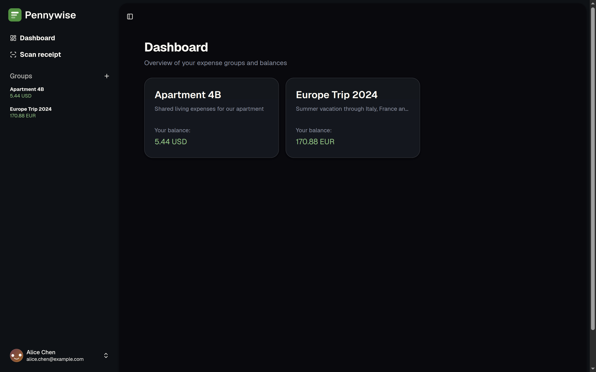
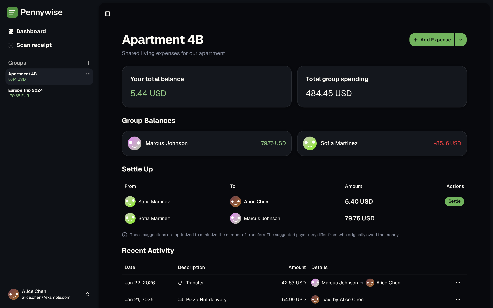

# Pennywise

A modern expense tracking and splitting application for groups. Keep track of shared expenses, record money transfers between members, and see who owes what at a glance.

## Features

- **Expense Tracking** - Record expenses with multiple beneficiaries and weighted splits
- **Money Transfers** - Track payments between group members
- **Multi-Currency Support** - Handle expenses in different currencies with separate balance tracking
- **Real-Time Balances** - See who owes what, updated instantly as expenses and transfers are added
- **Activity Feed** - View all group transactions in one unified timeline
- **Group Management** - Create groups, invite members, and customize splitting weights

## Screenshots

<!-- Add screenshots here -->






## Getting Started

### Prerequisites

- Go 1.25 or later
- Node.js 20 or later
- [just](https://github.com/casey/just) command runner

### Setup

1. Clone the repository:
   ```bash
   git clone https://github.com/yourusername/pennywise.git
   cd pennywise
   ```

2. Install frontend dependencies:
   ```bash
   cd web && npm install && cd ..
   ```

3. Create a `.env` file with your configuration:
   ```
   AUTH_SECRET=your-secret-key-here
   ```

4. Start the development servers:
   ```bash
   just dev
   ```

   This starts both the Go backend (port 3333) and Vite dev server (port 5173) with hot reload.

5. Open http://localhost:3333 in your browser.

## License

This project is licensed under the GNU General Public License v3.0 - see the [LICENSE](LICENSE) file for details.
