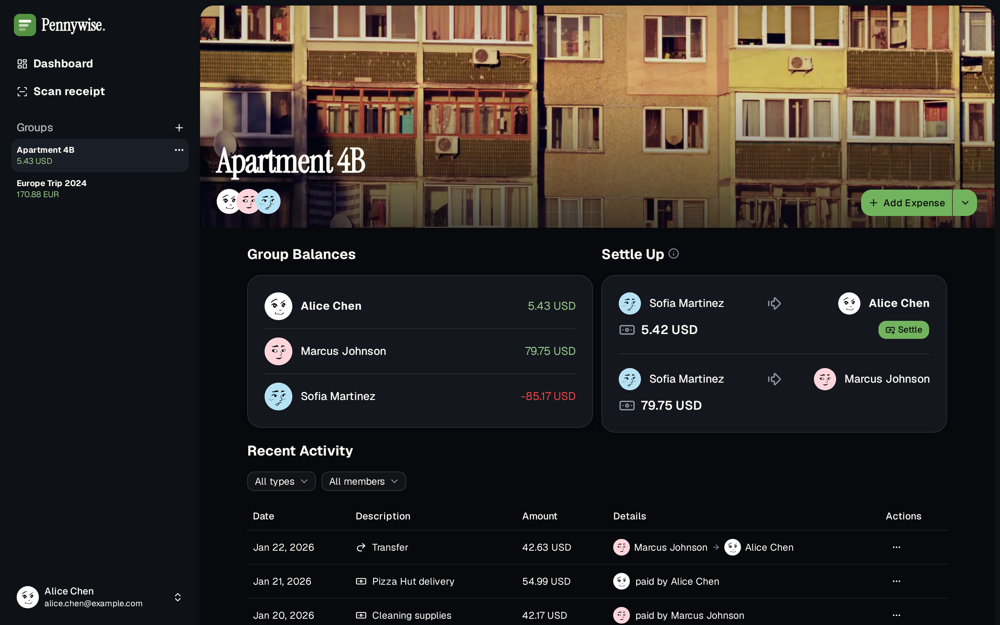
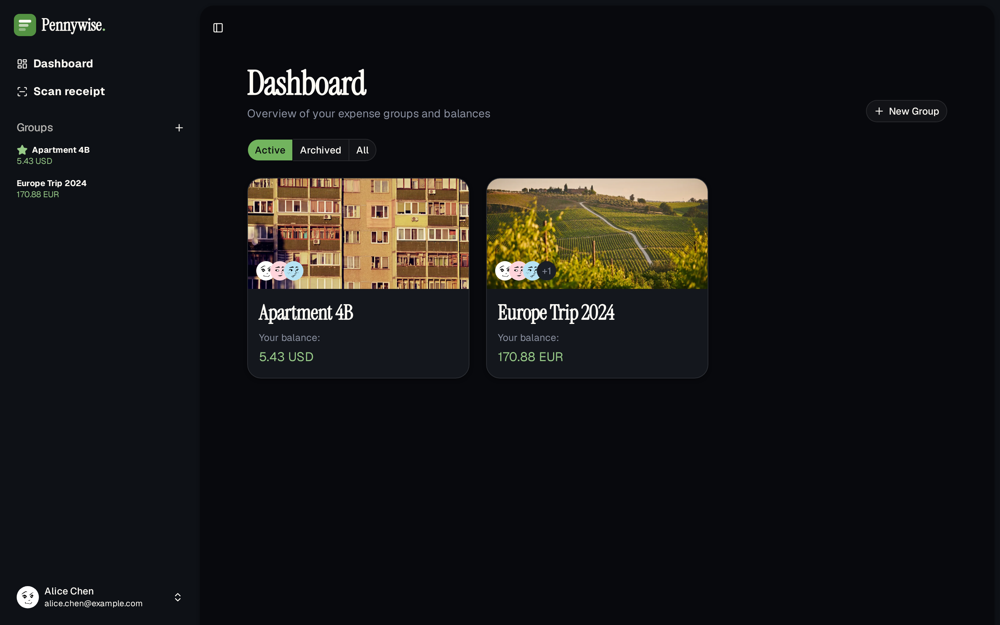
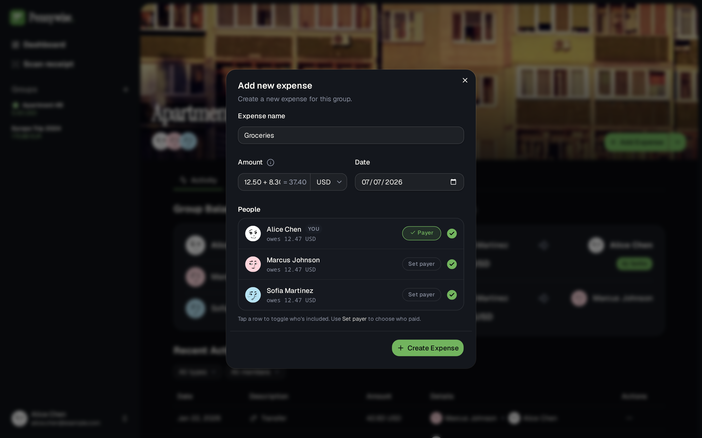

<div align="center">
  
  <h1>Pennywise</h1>
  <p>
    A self-hosted expense tracking and splitting application for groups. Keep track of shared expenses, record money transfers between members, and see who owes what at a glance.
  </p>
  <p>
    <a href="https://github.com/frysztak/pennywise/pkgs/container/pennywise"></a>
    <a href="https://github.com/frysztak/pennywise/pkgs/container/pennywise"></a>
    <a href="https://codecov.io/github/frysztak/pennywise"></a>
    <a href="https://hosted.weblate.org/engage/pennywise/"></a>
    <a href="LICENSE"></a>
  </p>
</div>


## Features

- **Expense Tracking** - Record expenses with multiple beneficiaries and weighted splits
- **Money Transfers** - Track payments between group members
- **Multi-Currency Support** - Handle expenses in different currencies with separate balance tracking
- **Currency Conversion** - Fold one currency's balance into another with auto-suggested exchange rates
- **Real-Time Balances** - See who owes what, updated instantly as expenses and transfers are added
- **Activity Feed** - View all group transactions in one unified timeline
- **Group Management** - Create groups, invite members, and customize splitting weights
- **AI-based receipt scanning** - Automatically extract data from receipts
- **Import from other apps** - Migrate existing projects from [ihatemoney](https://github.com/spiral-project/ihatemoney) or [Splitwise](https://www.splitwise.com/) via a CLI tool

## Screenshots

<details>

<summary>Group View</summary>



</details>

<details>

<summary>Dashboard</summary>



</details>

<details>

<summary>Add Expense</summary>



</details>


## Getting Started

### Prerequisites

- Go 1.25 or later
- Node.js 20 or later
- [just](https://github.com/casey/just) command runner

### Setup

1. Clone the repository:
   ```bash
   git clone https://github.com/frysztak/pennywise.git
   cd pennywise
   ```

2. Install frontend dependencies:
   ```bash
   cd web && npm install && cd ..
   ```

3. Create a `.env` file with your configuration:
   ```
   AUTH_SECRET=your-secret-key-here
   ```

4. Start the development servers:
   ```bash
   just dev
   ```

   This starts both the Go backend (port 3333) and Vite dev server (port 5173) with hot reload.

5. Open http://localhost:3333 in your browser.

## Configuration

Deployment-level settings are controlled by environment variables. The sections
below cover the most common setups; see
[`docs/configuration.md`](docs/configuration.md) for a complete reference of every
supported variable.

## Docker Setup

Add the following to your `compose.yaml`:

```yaml
services:
  pennywise:
    image: ghcr.io/frysztak/pennywise:latest
    restart: unless-stopped
    volumes:
      - /home/docker/pennywise/data:/data
    environment:
      - AUTH_SECRET=<...your key...>
```

Generate `AUTH_SECRET` using:

```bash
openssl rand -hex 32
```

## OIDC Setup

To enable OIDC authentication, add these environment variables to your container:

```yaml
environment:
  - OIDC_ISSUER=https://auth.example.com
  - OIDC_CLIENT_ID=pennywise
  - OIDC_CLIENT_SECRET=<...client secret...>
  - OIDC_REDIRECT_URL=https://pennywise.example.com/auth/oidc/callback
  - OIDC_PROVIDER_NAME=authelia
```

`OIDC_PROVIDER_NAME` is optional and only affects the login screen — it controls which name and brand icon the "Continue with …" button shows. Recognized values (case-insensitive): `authelia`, `authentik`, `keycloak`. Any other string renders with a generic key icon and the given label (e.g. `OIDC_PROVIDER_NAME="My SSO"`). Leave unset for a generic "Continue with OIDC" button.

You'll also need to configure your OIDC provider. Example configuration for Authelia:

```yaml
identity_providers:
  oidc:
    clients:
       - client_id: 'pennywise'
         client_name: 'Pennywise'
         client_secret: '<...client secret digest...>'
         public: false
         authorization_policy: 'one_factor'
         require_pkce: false
         pkce_challenge_method: ''
         redirect_uris:
           - 'https://pennywise.example.com/auth/oidc/callback'
         scopes:
           - 'openid'
           - 'profile'
           - 'email'
         response_types:
           - 'code'
         grant_types:
           - 'authorization_code'
         access_token_signed_response_alg: 'none'
         userinfo_signed_response_alg: 'none'
         token_endpoint_auth_method: 'client_secret_post'
```

Generate `OIDC_CLIENT_SECRET` and `client_secret` using:

```bash
docker run authelia/authelia:latest authelia crypto hash generate pbkdf2 --variant sha512 --random --random.length 72 --random.charset rfc3986
```

## Receipt Scanning (AI OCR)

Pennywise can extract expense details from receipt photos using any vision model. To enable it with OpenAI, set the following environment variables:

```yaml
environment:
  - OPENAI_API_KEY=<...your api key...>
  - OPENAI_OCR_MODEL=gpt-5-mini
```

### Ollama Example

You can also point Pennywise at a local [Ollama](https://ollama.com/) instance running a vision-capable model:

```yaml
environment:
  - OPENAI_BASE_URL=http://ollama:11434/v1
  - OPENAI_API_KEY=ollama
  - OPENAI_OCR_MODEL=gemma4:9b
```

## Currency Conversion (Exchange Rates)

Multi-currency groups can fold one currency's outstanding balance into another
with a **currency conversion** action. When creating a conversion, Pennywise
pre-fills the exchange rate from a provider — by default
[Frankfurter](https://frankfurter.dev/) (ECB data, keyless, no quota). The rate
is only a suggestion: it can always be overridden or entered manually, and the
rate used is stored on the conversion so settlement math never depends on a live
API call.

The defaults need no configuration. To self-host the provider or override it:

```yaml
environment:
  - FX_PROVIDER=frankfurter            # provider id (default: frankfurter)
  - FX_BASE_URL=https://fx.example.com/v1  # override for a self-hosted instance
  # - FX_API_KEY=<...>                 # reserved for a future keyed provider
```

If the provider is unreachable, conversion creation still works — the UI falls
back to manual rate entry.

## Migrating from other apps

A CLI tool ships with the repo for importing projects from [ihatemoney](https://github.com/spiral-project/ihatemoney) or [Splitwise](https://www.splitwise.com/). See [`cmd/migrate/README.md`](cmd/migrate/README.md) for the full workflow, mapping file format, and flags.

## Translations

Pennywise is localized via [Weblate](https://weblate.org/). The project currently ships English and Polish, and contributions for new languages are welcome — no coding required.

[](https://hosted.weblate.org/engage/pennywise/)

Head to the [Pennywise project on Hosted Weblate](https://hosted.weblate.org/projects/pennywise/) to start translating directly in the browser.

## License

This project is licensed under the GNU General Public License v3.0 - see the [LICENSE](LICENSE) file for details.
